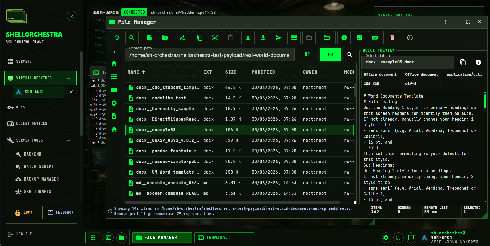
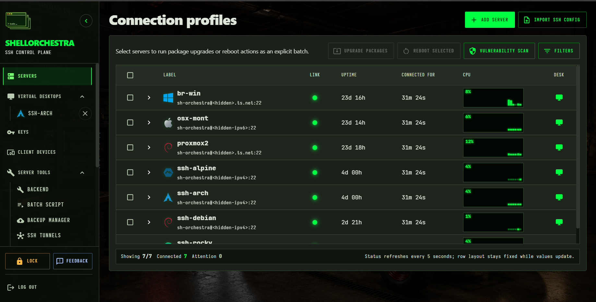
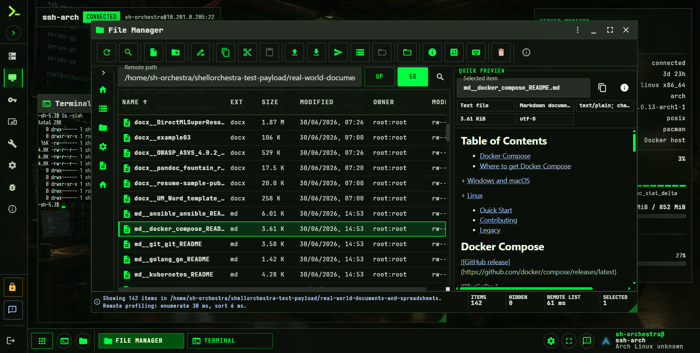

# ShellOrchestra

ShellOrchestra is an agentless, self-hosted service for managing servers from one control plane. It uses SSH and standard operating-system tools, so managed servers do not need a ShellOrchestra daemon or agent installed on them.

Operators use a browser-based admin panel after installing ShellOrchestra on their own controller host.

## What ShellOrchestra does

- Manages server connection profiles from one self-hosted control plane.
- Connects through SSH without installing ShellOrchestra agents on managed servers.
- Provides a browser admin panel for server inventory, access setup, terminals, virtual desktops, and server tools.
- Supports ShellOrchestra SSH CA setup with short-lived SSH certificates, plus classic key-based fallback where needed.
- Uses trusted-device enrollment and explicit unlock flows for sensitive server access.
- Ships Community Edition for internal use, with Pro features and higher limits available through a commercial license.

## How you run it

- Recommended: install ShellOrchestra as a self-hosted Docker deployment on your own controller host.
- Alternative: install ShellOrchestra as a Windows app for a Docker-free local controller.
- Use the browser-based admin panel to manage servers after setup.

## Product screenshots

### Connection profiles

Fleet inventory, live connection state, CPU history, virtual desktop launch, batch actions, and vulnerability scan entry points in one operator view.

### Virtual desktop per server

Each managed server can have its own browser-based virtual desktop with terminals, File Manager, previews, server monitor widgets, and focused admin apps.

## Security and safety model

- Server access is protected by trusted-device enrollment, explicit unlock flows, split key shares, and short-lived SSH certificates, reducing reliance on long-lived server credentials.
- ShellOrchestra SSH CA private material is not used as one always-present backend secret; server access requires the backend runtime and a trusted client-side key share to participate in the unlock flow.
- Server access goes through SSH using standard OpenSSH and operating-system tools on managed servers.
- The Docker deployment separates gateway, static UI serving, authentication, API, SSH worker, CA signer, internal app runner, and edition-specific workers into distinct runtime roles.
- Sensitive SSH work is isolated from the browser admin panel and from internal app/plugin execution where the deployment mode supports that separation.

## Source availability

This repository publishes ShellOrchestra source code for inspection, security review, and permitted private modification under the ShellOrchestra Source Available License.

Official release builds, installers, update manifests, signing keys, packaging scripts, and deployment automation are produced by the official Develastic release pipeline. Public source access does not grant redistribution, hosted-service, MSP, OEM, white-label, or public-fork rights.

## Official installation and upgrades

Use the published product site for supported installation and upgrade instructions:

- Docker install and upgrade: <https://shellorchestra.com/docs/docker-install>
- Windows app install and upgrade: <https://shellorchestra.com/docs/windows-install>
- License: <https://shellorchestra.com/legal/license>

Official installers verify signed release metadata and artifacts before applying changes.

## Repository layout

- `backend/` — Go services and runtime roles.
- `frontend/` — Vite React SPA source.
- `desktop-client/` — native desktop shell source for platform packaging.
- `api/openapi.yaml` — public API contract draft.
- `scripts/` and `system-scripts/` — remote script catalog and target-detection scripts served by the product.
- `installer/` — public key-setup helpers for registering SSH trust on managed servers.

## License and editions

ShellOrchestra is source-available, not OSI open source. See `LICENSE.md` and the website copy at <https://shellorchestra.com/legal/license/>.

Community Edition is free for internal use, including business and production use, subject to the published edition limits in `EDITION-LIMITS.md`. Pro and other commercial rights are licensed separately by Develastic, s. r. o.
